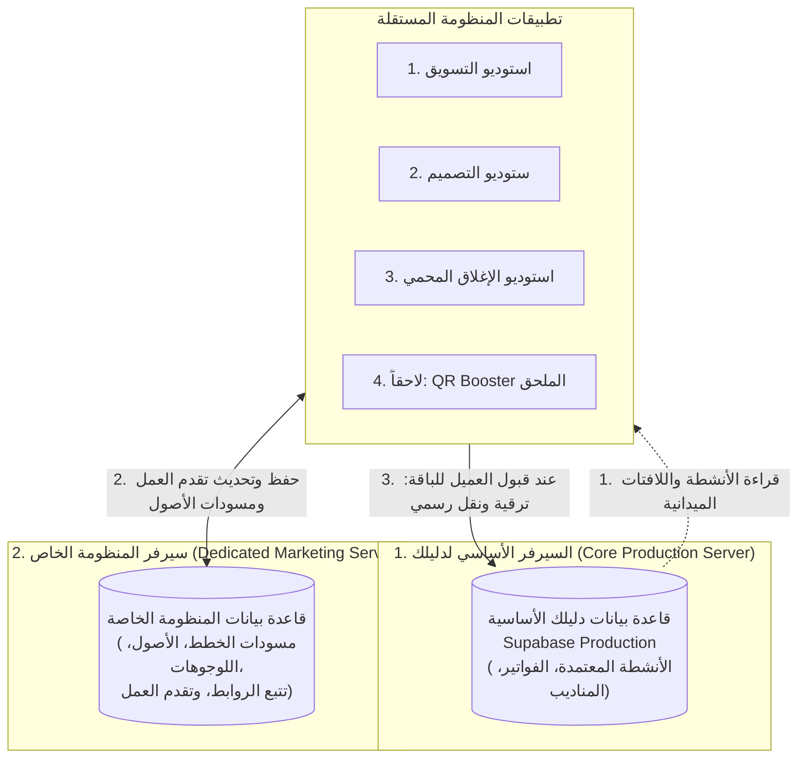

# 🗺️ دليلك • المخطط الهندسي الرئيسي لتطبيقات المنظومة المستقلة
# DALELAK SATELLITE ECOSYSTEM MASTER BLUEPRINT & PHASE SPECIFICATION

---

> ## 🤖 بروتوكول التشغيل الإلزامي لأي مساعد ذكاء اصطناعي (AI Agent Protocol)
> **هام جداً لكل نموذج ذكاء اصطناعي يقرأ هذا الملف في أي محادثة (Conversation):**
> 1. عند قراءة هذا الملف لأول مرة في أي محادثة جديدة، **يجب ألا تتشتت في تنفيذ كل التطبيقات معاً**.
> 2. مهمتك الفورية هي توجيه السؤال المباشر للمستخدم بالصيغة التالية تماماً:
>    > *"مرحباً بك! لقد استوعبت المخطط المعماري الكامل لمنظومة تطبيقات دليلك المستقلة. **في أي مرحلة نحن اليوم للبدء بتطويرها؟**"*
>    > * **المرحلة 1:** `Dalelak Marketing AI Studio` (استوديو التسويق واستراتيجية المحتوى للأنشطة).
>    > * **المرحلة 2:** `Dalelak Visual Identity Studio` (ستوديو الهوية البصرية وتوليد اللوجوهات والبراويز والكتالوجات).
>    > * **المرحلة 3:** `Dalelak Pitch Showcase & Anti-Theft Studio` (استوديو العروض الترويجية والإغلاق البيعي المحمي).
> 3. بمجرد أن يحدد المستخدم المرحلة (مثلاً: "المرحلة 1" أو "المرحلة 2" أو "المرحلة 3")، **انتقل فوراً وبشكل حصري ودقيق 100% إلى قسم تلك المرحلة في هذا المستند** ونفّذ مجلد المشروع ومكوناته بالكامل دون خلط أو تشتيت.

---

## 🏛️ 1. المعمارية الهيكلية المشتركة (The Shared Foundation)

كل تطبيق من التطبيقات هو **تطبيق مستقل تماماً واجهياً وتشغيلياً (Decoupled Satellite Web App)**، مستنسخ معمارياً من النموذج المجرّب والناجح في تطبيق `QR booster` الذي يمتلك **مستودعه الخاص المستقل** على GitHub:  
🔗 **`https://github.com/Islamitech/Dalilaak-QR`**  
(مسار المجلد المحلي: `C:\Users\karee\OneDrive\Desktop\Ahmed Files\QR boster`).

### 1.1 المكدس التقني والمظهر المعتمد (Unified Tech Stack & UI):
* **Framework:** React 19 + TypeScript + Vite.
* **Styling & Theme:** Tailwind CSS (v4) بتنسيق RTL أصيل، **بمظهر نهاري واحد ناصع ومريح (Light Mode Only)** دون أي تعقيد أو تشويش لثيم داكن.
* **Icons:** `lucide-react`.
* **AI Engine:** Google Gemini API (`@google/genai` v2.4.0+).
* **Graphics & Export:** `html2canvas` / `html-to-image` / `jspdf` / Canvas API.
* **Architecture Pattern:** Independent React Single Page App (SPA) + Client-side Intelligence.

---

### 🌐 1.2 معمارية السيرفرات وقواعد البيانات متعددة الطبقات (Multi-Tier Server Architecture):

تعتمد المنظومة على **نمط السيرفرات المزدوجة وتدفق البيانات الذكي** لضمان سرعة الإنتاج وحماية السيرفر الأساسي:



#### تفصيل السيرفرات الثلاثة وفق متطلبات التشغيل:
1. **السيرفر 1: السيرفر الأساسي لدليلك (Core Production Server):**
   - السيرفر الرسمي التشغيلي المعتمد (`https://xdqpbajymacpdccorjcj.supabase.co`).
   - مسؤول عن: الأنشطة المعتمدة والمفعلة، فواتير الأرباح، المناديب الميدانيين، وإصدارات واتساب الرسمية.
2. **السيرفر 2: سيرفر المنظومة الخاص (Dedicated Ecosystem Staging Server):**
   - سيرفر وقاعدة بيانات مخصصة ومستقلة تماماً لاستوديوهات المنظومة.
   - وظيفته الأساسية:
     - حفظ تقدم العمل (Work Progress) لكل نشاط تجاري أولاً بأول.
     - تخزين مخرجات الذكاء الاصطناعي: مسودات خطط المحتوى (30 يوماً)، نصوص الإعلانات، ملفات اللوجوهات، والبراويز المصممة.
     - تخزين سجلات تتبع فتح الروابط من أصحاب الأنشطة (Engagement & Lead Tracking).
     - عزل المسودات والعينات عن السيرفر الأساسي لمنع تضخمه ببيانات غير مؤكدة.
3. **آلية الترقية والنقل إلى السيرفر الأساسي (Client Conversion & Asset Promotion):**
   - بمجرد أن يفتح العميل العرض ويوافق على الاشتراك في باقة تسويقية أو توثيقية:
     - يضغط المشرف زر: **«ترقية واعتماد النشاط للسيرفر الأساسي» (Promote to Core Production)**.
     - يتم نقل النشاط مع أصوله المعتمدة (اللوجو الأصلي، البراويز النظيفة، خطة المحتوى، وبيانات الفاتورة) إلى **السيرفر الأساسي لدليلك**، ليصبح نشاطاً معتمداً يتابعه فريق العمل والمناديب.
4. **السيرفر الأساسي في بعض الحالات (Direct Core Read):**
   - في بعض الحالات، تقرأ تطبيقات المنظومة مباشرة من السيرفر الأساسي لجلب الأنشطة المسجلة حديثاً وصور لافتاتها الميدانية لبدء دورة العمل التسويقية لها.
5. **إلحاق ودمج تطبيق `QR booster`:**
   - بعد الانتهاء من تطوير واختبار المراحل الثلاث الحالية، سيتم إلحاق ودمج تطبيق `QR booster` ليصبح جزءاً رسمياً من هذه المنظومة ويرتبط بنفس السيرفرين ونفس تدفق العمل.

---

### 1.3 العقد البرمجي الموحد لبيانات الأنشطة (`DalilakBusiness`):
```typescript
export interface DalilakBusiness {
  id: string;
  name_ar: string;
  name_en?: string;
  category?: string;
  governorate?: string;
  city?: string;
  street?: string;
  landmark?: string;
  phone: string;
  secondary_phone?: string;
  working_hours?: string;
  description?: string;
  lat?: number;
  lng?: number;
  owner_name?: string;
  owner_phone?: string;
  photos?: string[]; // تتضمن صور الواجهة الميدانية واللافتة والكروت بتشفير Base64
  google_maps_url?: string;
  google_place_id?: string;
  verification_status?: string;
  notes?: string | Record<string, any>;
  created_at?: string;
}
```

### 1.4 المكونان المرجعيان المشتركان في كل تطبيق:
1. **`src/services/dalilakService.ts`**: لتبادل البيانات بين سيرفر المنظومة الخاص والسيرفر الأساسي، واستخراج بيانات التحقق وجوجل ماب.
2. **`src/components/DalilakActivitiesModal.tsx`**: النافذة المنبثقة المدمجة في ترويسة كل تطبيق للبحث وسحب أي نشاط بضغطة زر واحدة.

---

## 🎯 2. هندسة المرحلة 1: استوديو التسويق واستراتيجية المحتوى للأنشطة
### `Dalelak Marketing AI Studio` (Phase 1)

* **مسار مجلد المشروع المحلي:**  
  `C:\Users\karee\OneDrive\Desktop\Ahmed Files\Dalelak-Marketing-Studio`
* **مستودع وسيرفر الرفع النهائي (GitHub Repository):**  
  🔗 **`https://github.com/Islamitech/Dalelak-Marketing`**
* **المظهر البصري:** مظهر نهاري واحد ناصع ومريح (Light Mode Only).
* **الهدف الأساسي:**  
  أداة استوديو ذكية تمكّن مدير التسويق من سحب أي نشاط تجاري وتوليد هوية تسويقية، ونبرة صوت، وشعار إعلاني، وخطة محتوى شهرية (30 يوماً)، ونصوص إعلانات احترافية باللهجة المصرية، ورسائل واتساب موجهة، مع حفظ تقدم العمل في سيرفر المنظومة وإمكانية الترقية للسيرفر الأساسي، وتصدير تقرير تسويقي متكامل كملف PDF للعميل.

### 2.1 شجرة الملفات والمكونات المعيارية:
```text
Dalelak-Marketing-Studio/
├── index.html
├── package.json
├── vite.config.ts
├── src/
│   ├── main.tsx
│   ├── App.tsx
│   ├── types.ts
│   ├── services/
│   │   ├── dalilakService.ts        # الربط مع سيرفر المنظومة والسيرفر الأساسي
│   │   └── geminiMarketingEngine.ts # محرك التحليل والتوليد التسويقي عبر Gemini
│   ├── utils/
│   │   ├── egyptianDialectPrompts.ts# هندسة البرومبتات المتخصصة في السوق المصري
│   │   └── pdfReportGenerator.ts    # تصدير التقرير التسويقي الفاخر (jsPDF)
│   ├── components/
│   │   ├── Header.tsx               # شريط الترويسة النهاري + زر اختيار الأنشطة + الإعدادات
│   │   ├── DalilakActivitiesModal.tsx# نافذة سحب الأنشطة
│   │   ├── BusinessOverviewCard.tsx # ملخص بيانات المنشأة الجغرافية والفئة
│   │   ├── PersonaStrategyPanel.tsx # هوية التخاطب ونبرة الصوت والشعار
│   │   ├── ContentCalendarView.tsx  # جدول خطة المحتوى (30 يوماً مقسمة لركائز)
│   │   ├── ReadyPostsTabs.tsx       # تبويبات نصوص المنشورات والإعلانات الجاهزة للنشر
│   │   ├── WhatsAppCampaignsTab.tsx # قوالب رسائل الواتساب الإعلانية المباشرة
│   │   ├── PromoteToCoreButton.tsx  # زر ترقية النشاط واعتماده في السيرفر الأساسي لدليلك
│   │   └── ExportReportModal.tsx    # نافذة تخصيص وتنزيل تقرير الـ PDF
```

---

## 🎨 3. هندسة المرحلة 2: ستوديو الهوية البصرية والتصميم والكتالوجات
### `Dalelak Visual Identity Studio` (Phase 2)

* **مسار مجلد المشروع المحلي:**  
  `C:\Users\karee\OneDrive\Desktop\Ahmed Files\Dalelak-Visual-Studio`
* **مستودع وسيرفر الرفع النهائي (GitHub Repository):**  
  🔗 **`https://github.com/Islamitech/Dalelak-Visual`**
* **المظهر البصري:** مظهر نهاري ناصع ومريح (Light Mode Only).
* **الهدف الأساسي:**  
  ستوديو تصميمي رقمي يقرأ الصور الميدانية الحقيقية (لافتات الشارع، الواجهات، الكروت الشخصية)، ويحولها إلى:
  1. شعار رقمي فيكتور متطور ونقي (Signboard-to-Vector Logo).
  2. براويز وقوالب منشورات سوشيال ميديا موحدة تدمج صور المنتجات تلقائياً داخل الإطار بضغطة زر.
  3. كتالوج مصغر وقوائم أسعار (Services & Pricing Menu Maker).
  4. قوالب عروض ترويجية وتخفيضات موسمية.
  5. حفظ الأصول في سيرفر المنظومة وترقيتها للسيرفر الأساسي عند التعاقد.

### 3.1 شجرة الملفات والمكونات المعيارية:
```text
Dalelak-Visual-Studio/
├── index.html
├── package.json
├── vite.config.ts
├── src/
│   ├── main.tsx
│   ├── App.tsx
│   ├── types.ts
│   ├── services/
│   │   ├── dalilakService.ts       # سحب بيانات وصور النشاط وحفظ الأصول بسيرفر المنظومة
│   │   └── visualAiService.ts      # محرك تحليل اللافتات وتوليد الشعارات بالذكاء الاصطناعي
│   ├── utils/
│   │   ├── canvasRenderer.ts       # محرك تصيير قوالب السوشيال ميديا عالية الدقة (HTML5 Canvas)
│   │   └── vectorLogoPresets.ts    # أيقونات وعناصر تجميلية فيكتور جاهزة
│   ├── components/
│   │   ├── Header.tsx              # الترويسة النهارية + زر أنشطة دليلك + زر الترقية للسيرفر الأساسي
│   │   ├── DalilakActivitiesModal.tsx
│   │   ├── WorkspaceSplitView.tsx  # شاشة مقسومة: أدوات التعديل يميناً + المعاينة الحية يساراً
│   │   ├── LogoStudioPanel.tsx     # تبويب تحويل اليافطة وتوليد وتعديل الشعار
│   │   ├── SocialFramePanel.tsx    # صانع براويز المنشورات (إسقاط صورة الموبايل داخل الإطار)
│   │   ├── MenuCatalogPanel.tsx    # صانع قوائم الأسعار والخدمات متعددة الباقات
│   │   ├── PromoBannerPanel.tsx    # صانع بوستات العروض والخصومات الجذابة
│   │   └── ExportAssetsModal.tsx   # تنزيل ملفات عالية الدقة (PNG 300DPI / PDF Vector)
```

---

## 🛡️ 4. هندسة المرحلة 3: استوديو العروض الترويجية والإغلاق البيعي المحمي
### `Dalelak Pitch Showcase & Anti-Theft Studio` (Phase 3)

* **مسار مجلد المشروع المحلي:**  
  `C:\Users\karee\OneDrive\Desktop\Ahmed Files\Dalelak-Pitch-Showcase`
* **مستودع وسيرفر الرفع النهائي (GitHub Repository):**  
  🔗 **`https://github.com/Islamitech/Dalelak-Pitch-Showcase`**
* **المظهر البصري:** مظهر نهاري ناصع ومريح (Light Mode Only).
* **الهدف الأساسي:**  
  ماكينة الإغلاق البيعي الذاتي؛ تدمج مخرجات (المرحلة 1) و (المرحلة 2) المخزنة في سيرفر المنظومة، وتنشئ صفحة استعراض تفاعلية مبهرة مخصصة لصاحب المحل على هاتفه المحمول، محمية بـ 3 طبقات ضد السرقة، مع توليد رسالة واتساب نفسية إقناعية وتتبع لحظي لفتح الرابط، مع إمكانية تحويل النشاط وفاتورته مباشرة للسيرفر الأساسي بمجرد الموافقة.

### 4.1 شجرة الملفات والمكونات المعيارية:
```text
Dalelak-Pitch-Showcase/
├── index.html
├── package.json
├── vite.config.ts
├── src/
│   ├── main.tsx
│   ├── App.tsx
│   ├── types.ts
│   ├── services/
│   │   ├── dalilakService.ts       # سحب النشاط + حفظ حزم العروض + الترقية للسيرفر الأساسي
│   │   └── leadTrackingService.ts  # تتبع وقت فتح الرابط ومدة التصفح
│   ├── utils/
│   │   ├── watermarkEngine.ts      # تطبيق العلامة المائية الشبكية غير القابلة للإزالة
│   │   ├── mockupComposer.ts       # تركيب التصاميم داخل مجسمات 3D (iPad / Acrylic Stand)
│   │   └── pitchMessageBuilder.ts  # صياغة رسائل الواتساب النفسية بالبيانات الحقيقية
│   ├── components/
│   │   ├── Header.tsx              # ترويسة نهارية + زر الأنشطة + إدارة السيرفرات
│   │   ├── DalilakActivitiesModal.tsx
│   │   ├── AdminPitchComposer.tsx  # لوحة الإدارة لاختيار وتجهيز حزمة الإبهار لكل نشاط
│   │   ├── WatermarkControls.tsx   # ضبط شدة ونص العلامة المائية والقفل
│   │   ├── ClientTeaserPreview.tsx # معاينة ما سيراه العميل بالضبط على هاتفه
│   │   ├── WhatsAppCopyModal.tsx   # نافذة فحص رسالة الواتساب وإرسالها المباشر
│   │   ├── PromoteLeadModal.tsx    # نافذة ترقية العميل ونقله إلى السيرفر الأساسي فور الاشتراك
│   │   └── LiveTrackerFeed.tsx     # تنبيهات حية: العميل (فلان) يتصفح الرابط الآن!
```

---

## 📊 5. سجل حالة ومتابعة تنفيذ المنظومة (Execution Tracker)

| رقم المرحلة | اسم التطبيق المستقل | مستودع الرفع (GitHub) | المظهر | الحالة الحالية |
| :---: | :--- | :--- | :---: | :---: |
| **0** | **دليلك الأساسي (المنصة الرئيسية)** | `https://github.com/Islamitech/Dalilak` | نهاري | ✅ **مكتمل ومستقر** |
| **QR** | **تطبيق QR Booster المستقل** | `https://github.com/Islamitech/Dalilaak-QR` | نهاري | ✅ **مكتمل وله مستودعه الخاص** |
| **1** | **Dalelak Marketing AI Studio** | `https://github.com/Islamitech/Dalelak-Marketing` | نهاري فقط | ✅ **مكتمل ومستقر** |
| **2** | **Dalelak Visual Identity Studio** | `https://github.com/Islamitech/Dalelak-Visual` | نهاري فقط | ✅ **مكتمل ومستقر وجاهز للتشغيل** |
| **3** | **Dalelak Pitch Showcase Studio** | `https://github.com/Islamitech/Dalelak-Pitch-Showcase` | نهاري فقط | ✅ **مكتمل ومستقر وجاهز للتشغيل** |
| **4** | **ربط QR Booster بالمعمارية المزدوجة** | `https://github.com/Islamitech/Dalilaak-QR` | نهاري | ⏳ **بعد اكتمال المراحل الثلاث** |

---

> ### 📌 للتذكير عند فتح محادثة جديدة:
> اطلب من المساعد قراءة هذا الملف:  
> `DALELAK_ECOSYSTEM_MASTER_BLUEPRINT.md`  
> وسيبادرك المساعد فوراً بسؤالك: **"في أي مرحلة نحن اليوم؟"** لتنفيذ المرحلة المطلوبة بأقصى سرعة ودقة هندسية!
