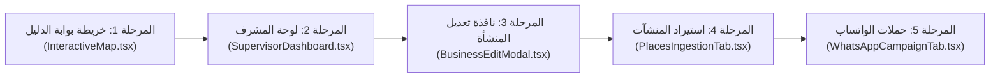

# 🏗️ المخطط المعماري الشامل لتفكيك وهيكلة ملفات منصة دليلك (Dalelak Codebase Decomposition Blueprint)

## 🎯 أهداف خطة التفكيك (Architecture Objectives)
1. **السرعة الخاطفة في التعديل والاستجابة:** تقليل حجم الملف الواحد من **1,500 - 3,000 سطر** إلى **100 - 250 سطر بحد أقصى**.
2. **تسريع التطوير اللحظي (Ultra-fast Vite HMR):** تحديث الشاشة في أجزاء من الثانية بدلاً من ثوانٍ طويلة عند حفظ أي تعديل.
3. **صفر أخطاء (Zero Regression Guarantee):** الحفاظ الصارم بنسبة 100% على جميع الواجهات (Props Contracts) والوظائف والـ State السارية دون كسر أي ميزة.

---

## 🗺️ خريطة الملفات المستهدفة بالتفكيك المعماري

### 1. خريطة بوابة الدليل التفاعلية
- **الملف الحالي:** `dalelak-directory-portal/src/components/InteractiveMap.tsx` (~1,717 سطر)
- **المجلد الجديد:** `dalelak-directory-portal/src/components/map/`
- **التفكيك إلى:**
  1. `hooks/useMapInstance.ts` (~120 سطر): إدارة تهيئة Leaflet، كاش البلاطات (Google/CARTO)، ومزامنة الـ `liveCenterRef` وحجم الـ Viewport.
  2. `hooks/useMapPinsClustering.ts` (~140 سطر): تجميع الدبابيس حسب مسافة البكسلات (Screen-space clustering) و Viewport Culling.
  3. `MapDistrictsOverlay.tsx` (~160 سطر): رسم حدود أحياء حدائق الأهرام الرسمية (أ، ب، ج...) مع الـ Tooltips والتلوين الذكي.
  4. `MapGatesOverlay.tsx` (~90 سطر): دبابيس ومعلومات بوابات حدائق الأهرام (خوفو، مينا، حورس...).
  5. `MapHeaderBar.tsx` (~110 سطر): شريط التبديل العلوي وأزرار الطبقات وتصفية المحافظات.
  6. `MapFloatingControls.tsx` (~100 سطر): أزرار التحريك الاتجاهي والتقريب والتكبير.
  7. `MapSearchBox.tsx` (~120 سطر): البحث الفوري والقفز الجغرافي.
  8. `InteractiveMap.tsx` (~130 سطر): المكون المنسق الخفيف (Orchestrator Component) مستخدماً الـ Portal.

---

### 2. لوحة المشرف الإقليمي (Supervisor Dashboard)
- **الملف الحالي:** `src/components/SupervisorDashboard.tsx` (~1,488 سطر)
- **المجلد الجديد:** `src/components/supervisor/`
- **التفكيك إلى:**
  1. `hooks/useSupervisorMetrics.ts` (~130 سطر): احتساب إحصاءات المستهدفات، عهد المناديب، ونسب الإنجاز.
  2. `views/SupervisorHubView.tsx` (~180 سطر): كروت الإحصاءات التفاعلية الأربعة وأزرار الإجراءات السريعة.
  3. `views/SupervisorRepsView.tsx` (~160 سطر): إدارة فريق مناديب المحافظة ومتابعة نشاطهم.
  4. `views/SupervisorBusinessesView.tsx` (~180 سطر): جدول فحص وتدقيق واعتماد المنشآت المسجلة.
  5. `views/SupervisorFinanceView.tsx` (~150 سطر): كشف العهد النقدية وتوريدات المناديب وطلبات السحب.
  6. `views/SupervisorLeadsView.tsx` (~140 سطر): إدارة العملاء المحتملين (CRM) وإرسال واتساب مباشر.
  7. `views/SupervisorMapView.tsx` (~90 سطر): خريطة التغطية الميدانية الجغرافية للمحافظة.
  8. `SupervisorDashboard.tsx` (~120 سطر): شريط التنقل العلوي وتوزيع الـ Sub-views.

---

### 3. لوحة حملات وبث الواتساب (WhatsApp Campaign Tab)
- **الملف الحالي:** `src/components/admin/tabs/AdminWhatsAppCampaignTab.tsx` (~3,087 سطر)
- **المجلد الجديد:** `src/components/admin/tabs/whatsapp-campaign/`
- **التفكيك إلى:**
  1. `hooks/useCampaignSender.ts` (~200 سطر): محرك الإرسال المتتابع، معدلات الأمان، فترات التهدئة، واستئناف الحملات.
  2. `components/CampaignAudienceSelector.tsx` (~180 سطر): فلترة واختيار المنشآت المستهدفة حسب المحافظة والنشاط وحالة السداد.
  3. `components/CampaignMessageComposer.tsx` (~190 سطر): محرر قوالب الرسائل، المتغيرات الديناميكية `{name}`، والمرفقات.
  4. `components/CampaignLiveProgress.tsx` (~150 سطر): شاشات الرادار اللحظية لنسبة الإرسال، الرسائل الناجحة والفاشلة.
  5. `components/CampaignHistoryLog.tsx` (~160 سطر): أرشيف الحملات السابقة وتصدير التقارير.
  6. `AdminWhatsAppCampaignTab.tsx` (~140 سطر): المنسق العام للتبويب.

---

### 4. محرك تمشيط واستيراد المنشآت (Places Ingestion Tab)
- **الملف الحالي:** `src/components/admin/tabs/AdminPlacesIngestionTab.tsx` (~2,388 سطر)
- **المجلد الجديد:** `src/components/admin/tabs/places-ingestion/`
- **التفكيك إلى:**
  1. `hooks/usePlacesIngestionFlow.ts` (~200 سطر): إدارة مراحل الاستكشاف، وتتبع التقدم، والاتصال بنقاط السيرفر.
  2. `components/IngestionConfigPanel.tsx` (~180 سطر): اختيار المنطقة، والشبكة الميكروية، والفئات، ونصف القطر.
  3. `components/DiscoveredPlacesGrid.tsx` (~220 سطر): جدول استعراض الأنشطة المكتشفة مع التحديد الجماعي والفلاتر.
  4. `components/IngestionEnrichmentModal.tsx` (~160 سطر): شاشات سحب الصور وساعات العمل والتقييمات قبل الحفظ النهائي.
  5. `AdminPlacesIngestionTab.tsx` (~130 سطر): المنسق العام للتبويب.

---

### 5. نافذة تعديل بيانات المنشأة (Business Edit Modal)
- **الملف الحالي:** `src/components/BusinessEditModal.tsx` (~1,688 سطر)
- **المجلد الجديد:** `src/components/business-edit/`
- **التفكيك إلى:**
  1. `hooks/useBusinessEditForm.ts` (~160 سطر): التحقق من صحة المدخلات وإدارة الحالة والحفظ.
  2. `tabs/EditBasicInfoTab.tsx` (~150 سطر): الاسم بالعربي والإنجليزي والتصنيف والوصف.
  3. `tabs/EditContactTab.tsx` (~130 سطر): أرقام الهاتف، الواتساب، والروابط والموقع الإلكتروني.
  4. `tabs/EditLocationTab.tsx` (~140 سطر): العنوان المكتوب وتحديد الإحداثيات على الخريطة.
  5. `tabs/EditMediaPricingTab.tsx` (~150 سطر): الصور، الفواتير، وحالة السداد والباقات.
  6. `BusinessEditModal.tsx` (~120 سطر): الحاوية الرأسية وتبديل التبويبات.

---

## 🚦 مراحل التنفيذ المقترحة (Execution Roadmap)

### القواعد الذهبية أثناء التفكيك (Golden Rules):
- ✅ **عدم تغيير أي سلوك أو منطق:** نقل الأكواد بحذر دون تعديل أي أسماء للمتغيرات المشتركة أو الواجهات.
- ✅ **الفحص الآلي بعد كل مرحلة:** تشغيل `npm run build` و `npx tsc --noEmit` بعد كل ملف للتأكد من صفر أخطاء.
- ✅ **الالتزام بملفات خفيفة:** لا يتجاوز أي ملف ناتج 200 سطر.

---

## 📝 رسالة التكليف الجاهزة للمحادثة الجديدة (Copy & Paste Prompt):

> **"السلام عليكم، أريد البدء في تنفيذ خطة التفكيك المعماري لتسريع الكود وتخفيف الملفات الضخمة وفق المستند: `docs/CODEBASE_DECOMPOSITION_BLUEPRINT.md`.**  
> **يرجى البدء فوراً بـ (المرحلة الأولى: تفكيك InteractiveMap.tsx في بوابة الدليل dalelak-directory-portal) مع الحفاظ التام على جميع المميزات ونظام الـ Portal والتأكد من نجاح الـ Build."**
