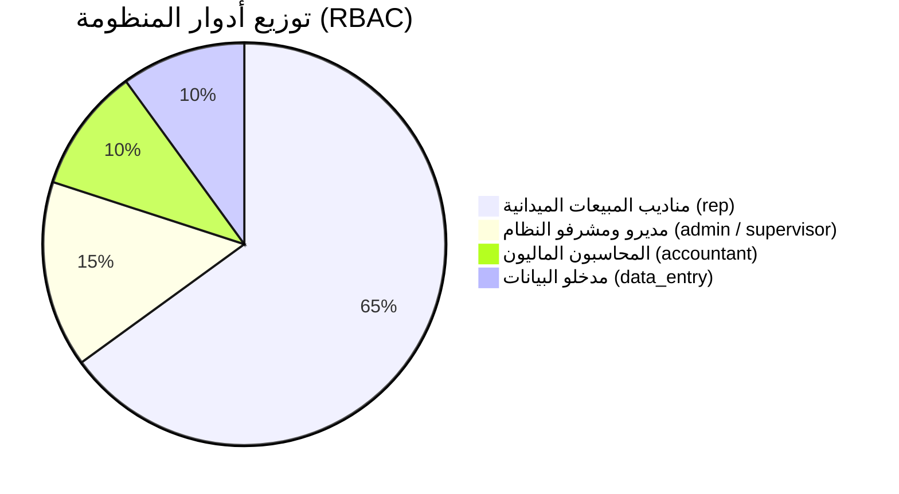

# 01 — الرؤية والقيود الحاكمة للمنتج (Product Vision & Constraints)

- **جذر المشروع:** `C:\Users\Ahmed\Desktop\New folder\Dalelak`
- **بصمة النسخة:** `ba63594132b130cd7da806484125fc508e0e4aa1`
- **الحالة:** معتمدة رسمياً (`AP-0001`) | التاريخ: 2026-09-17

---

## 1. تعريف ورؤية المنتج (Product Vision)

منصة **«دليلك»** هي بنية تقنية وطنية متكاملة تستهدف توثيق ورقمنة الأنشطة التجارية والخدمية والمهنية داخل جمهورية مصر العربية عبر منظومة عمل ميداني ذكية للمناديب، وربطها ببوابة دليل عامة فائقة السرعة للجمهور.

### الفلسفة التشغيلية الحاكمة (The Sovereign Paradigm):
تتبنى المنظومة نهج **«صفحة المندوب الذكية»** كمعيار عام لتصميم كافة واجهات وعمليات النظام:
1. **المركز الأحادي البسيط (Single Dashboard Hub):** منع تشتت المستخدم عبر واجهة رئيسية واحدة جامعة وخالية من الكتل النصية المجهدة.
2. **التصنيف الثنائي الصارم:**
   - **المهام الفورية المباشرة:** تُعرض كأزرار سريعة وأنيقة (Quick Actions) تنفذ بنقرة واحدة.
   - **المهام ذات المؤشرات والأرقام الحية:** تُعرض في بطاقات إحصائية تفاعلية (Stat Action Cards)، وعند النقر عليها تتفرع بسلاسة لشاشة تفاصيلها مع زر رجوع موحد (`← العودة للرئيسية`).
3. **انعدام المقاطعة (Zero Interruption):** استبعاد كافة تنبيهات وتأكيدات المتصفح التقليدية (`alert` / `confirm`) لصالح إشعارات داخلية فورية ونوافذ تأكيد مخصصة عالية الأناقة.

---

## 2. جدول القيود الحاكمة المعتمدة (Core Constraints Matrix)

| القيد المعماري | الصفة | المصدر والسند | موضع الفرض في الشيفرة | أثر كسر القيد | الدليل السندي |
| :--- | :--- | :--- | :--- | :--- | :--- |
| **دعم RTL وخط Cairo القياسي** | قائم ومعتمد | متطلبات الهوية المصرية والعربية | `index.html`, `Drawer.tsx`, `RepresentativePortal.tsx` | تشوه بصري وانقلاب اتجاه القوائم | `EV-0019; E0; V2` |
| **استقلالية المستودعين (Dual-Repo)** | قائم ومعتمد | وثيقة `AGENTS.md` | إعدادات Git Remotes في كِلا المجلدين | خلط أكواد الإدارة بالبوابة العامة للجمهور | `EV-0002; E0; V2` |
| **التحقق الإجباري من جنس المندوب (`gender`)** | قائم ومعتمد | طلب المستخدم الصريح ومخطط Supabase | `RegisterForm.tsx`, `dbMappers.ts`, جدول `representatives` | رفض التسجيل أو خطأ في مخطط البيانات | `EV-0009; E0; V3` |
| **حظر التنبيهات التقليدية (No native alert/confirm)** | قائم ومعتمد | بروتوكول تجربة المستخدم السيادية | `ConfirmDialog.tsx`, كافة المكونات | كسر تجربة الاستخدام الميداني على الجوال | `EV-0019; E0; V2` |
| **حماية الحسابات الحساسة (Super Admin Exclusivity)** | قائم ومعتمد | سياسات الأمان والحوكمة | `src/utils/permissions.ts:isSuperAdmin` | حذف غير مقصود للمناديب أو الإداريين | `EV-0007; E0; V1` |
| **حفظ النقدية في العهدة (Cash-in-hand Tracking)** | قائم ومعتمد | الدورة المحاسبية للمنظومة | `RepresentativePortal.tsx`, `AdminPayoutsTab.tsx` | ضياع المبالغ المحصلة ميدانياً قبل التوريد | `EV-0012; E0; V2` |

---

## 3. خريطة الأدوار والجمهور المستهدف (Roles & Audience)

1. **مندوب المبيعات الميداني (`rep`):** العمل في الشارع، توثيق المنشآت، رفع الصور، تحصيل النقدية، ومتابعة عمولاته عبر شاشته المبسطة.
2. **مشرف المنطقة (`supervisor`):** متابعة أداء مناديب محافظته، تدقيق المنشآت، ومتابعة العملاء المحتملين.
3. **مدير النظام الأعلى (`admin`):** الصلاحيات السيادية الكاملة، إدارة الحسابات، بوابات الدفع، صرف العمولات، وسلة المحذوفات.
4. **جمهور الزوار (`visitor`):** البحث السريع عن الخدمات وتصفح الخرائط عبر بوابة `dalilaak.com` المستقلة.
