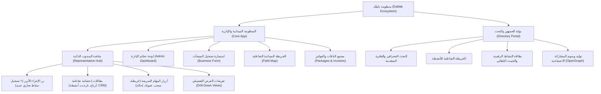

# 02 — جرد المداخل والوظائف الجوهرية (Core Functional Inventory)

- **جذر المشروع:** `C:\Users\Ahmed\Desktop\New folder\Dalelak`
- **بصمة النسخة:** `ba63594132b130cd7da806484125fc508e0e4aa1`
- **الحالة:** معتمدة رسمياً (`AP-0001`) | التاريخ: 2026-09-17
- **النهج المعماري الحاكم:** نهج صفحة المندوب الذكية (المركز الأحادي البسيط + أزرار المهام السريعة + بطاقات إحصائية تفاعلية متفرعة).

---

## 1. شجرة المداخل والأسطح الوظيفية (Functional Surfaces Tree)

---

## 2. جدول جرد المداخل والعمليات (Inventory Matrix)

| معرّف المدخل | نوعه ومساره | الدور والمحفز | الإجراء المنفذ | سلسلة الاستدعاء البرمجية | القدرة التابعة | حالة الربط | الدليل السندي |
| :--- | :--- | :--- | :--- | :--- | :--- | :--- | :--- |
| `ENT-0001` | واجهة جوال: `RepresentativePortal.tsx` | مندوب مبيعات (`rep`) | عرض المركز الأحادي البسيط والبطاقات الإحصائية | `App.tsx` → `RepresentativePortal` | `CAP-0001`, `CAP-0002` | متتبع ساكن ومتحقق | `EV-0004; E0; V2` |
| `ENT-0002` | زر Hero CTA: `+ تسجيل نشاط جديد` | مندوب / مشرف | فتح استمارة تسجيل وتوثيق منشأة تجارية | `RepresentativePortal` → `onOpenForm()` | `CAP-0003`, `CAP-0004` | متتبع ومربوط | `EV-0004; E0; V2` |
| `ENT-0003` | بطاقة إحصائية: رصيد الأرباح والمحفظة | مندوب | عرض الأرباح والتفرع لبيانات المحفظة وطلب السحب | `RepresentativePortal` → `setViewMode('wallet')` | `CAP-0002`, `CAP-0005` | متتبع ومربوط | `EV-0004; E0; V2` |
| `ENT-0004` | بطاقة إحصائية: نسبة إنجاز المستهدف (KPI) | مندوب | عرض شريط التقدم والتفرع لتحليل التارجت الميداني | `RepresentativePortal` → `setViewMode('target')` | `CAP-0002` | متتبع ومربوط | `EV-0004; E0; V2` |
| `ENT-0005` | بطاقة إحصائية: إجمالي الأنشطة المسجلة | مندوب | استعراض الأنشطة وإدارتها وتصفيتها بالبحث | `RepresentativePortal` → `setViewMode('businesses')` | `CAP-0002`, `CAP-0004` | متتبع ومربوط | `EV-0004; E0; V2` |
| `ENT-0006` | بطاقة إحصائية: عملاء الـ CRM المحتملون | مندوب / مشرف | متابعة الفرص البيعية وفتح مراسلات الواتساب | `RepresentativePortal` → `setViewMode('leads')` | `CAP-0002`, `CAP-0006` | متتبع ومربوط | `EV-0004; E0; V2` |
| `ENT-0007` | زر إجراء سريع: الخريطة الميدانية | مندوب | استكشاف الأنشطة المحيطة جغرافياً | `RepresentativePortal` → `setViewMode('map')` | `CAP-0003` | متتبع ومربوط | `EV-0004; E0; V2` |
| `ENT-0008` | زر إجراء سريع: طلب سحب العمولات | مندوب | فتح نافذة طلب سحب مستحقات وإرفاق وسيلة التحويل | `RepresentativePortal` → `setShowPayoutModal(true)` | `CAP-0003`, `CAP-0005` | متتبع ومربوط | `EV-0012; E0; V2` |
| `ENT-0009` | زر إجراء سريع: مشاركة كود الإحالة | مندوب | نسخ الرابط وتوليد باركود QR للإحالة | `RepresentativePortal` → `handleShareReferral()` | `CAP-0003` | متتبع ومربوط | `EV-0004; E0; V2` |
| `ENT-0010` | واجهة ويب: `AdminDashboard.tsx` | مدير النظام (`admin`) | لوحة التحكم المركزية بالعمليات والحسابات والمحفظة | `App.tsx` → `AdminDashboard` | `CAP-0009` | متتبع ومربوط | `EV-0006; E0; V2` |
| `ENT-0011` | تبويب: سلة المحذوفات والمراجعة | مدير النظام | استرجاع المنشآت والحسابات أو الحذف النهائي البات | `AdminDashboard` → `AdminAuditTrashTab` | `CAP-0009` | متتبع ومربوط | `EV-0013; E0; V2` |
| `ENT-0012` | تبويب: حملات ومراسلات الواتساب | مدير / مشرف | إطلاق حملات توثيق المنشآت وتدوير الخطوط | `AdminDashboard` → `AdminWhatsAppCampaignTab` | `CAP-0008` | متتبع ومربوط | `EV-0011; E0; V2` |
| `ENT-0013` | بوابة الجمهور: `PublicShowcase.tsx` | زائر / جمهور | تصفح الدليل العام والبحث وتثبيت النشاط بالرابط المباشر | `dalelak-directory-portal/src/App.tsx` | `CAP-0007` | متتبع ومربوط | `EV-0002; E0; V2` |
| `ENT-0014` | خادم Express محلي: `server.ts` | خادم التطبيق | تقديم واجهات API للتحقق والمصادقة والمزامنة | `server.ts` (المنفذ 3001) | `CAP-0009`, `CAP-0010` | متتبع ومربوط | `EV-0005; E0; V2` |
| `ENT-0015` | دالة Vercel السحابية: `api/share.ts` | محركات البحث والروبوتات | قراءة بطاقة النشاط وتوليد بطاقة OG للواتساب | `dalelak-directory-portal/api/share.ts` | `CAP-0007` | متتبع ومربوط | `EV-0016; E0; V2` |

---

## 3. ملخص تغطية المداخل
- **إجمالي المداخل الوظيفية المكتشفة:** 15 مدخلاً رئيساً.
- **إجمالي المداخل المفحوصة والمربوطة بالقدرات:** 15 مدخلاً (تغطية 100%).
- **حالة الروابط:** كافة الأزرار والبطاقات الإحصائية مرتبطة بدوال تنفيذية ومحمية بنظام `ConfirmDialog` أو إشعارات حية.
