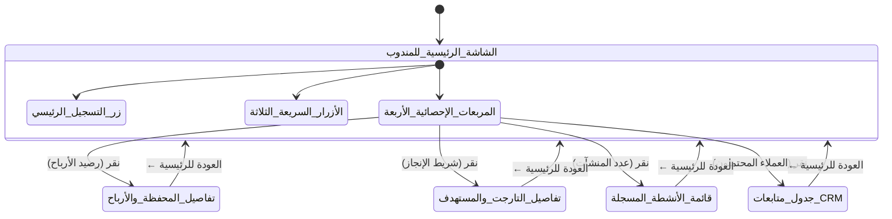

# 03 — مواصفات تجربة المستخدم المستهدفة (Target UX Specification)

- **جذر المشروع:** `C:\Users\Ahmed\Desktop\New folder\Dalelak`
- **بصمة النسخة:** `ba63594132b130cd7da806484125fc508e0e4aa1`
- **الحالة:** معتمدة رسمياً (`AP-0001`) | التاريخ: 2026-09-17

---

## 1. نموذج تجربة المستخدم الميدانية (Field Experience Model)

تعتمد التجربة المستهدفة على مفهوم **«الواجهة الصامتة الفائقة (The Ultra-Quiet UI)»** المصممة خصيصاً لظروف العمل الميداني تحت أشعة الشمس واستخدام اليد الواحدة:

---

## 2. مصفوفة التحول في تجربة المستخدم (UX Transition Matrix)

| السطح / المسار | الجمهور | السلوك السابق | السلوك السيادي المعتمد | سبب التحول والتحسين |
| :--- | :--- | :--- | :--- | :--- |
| **شاشة المندوب** | المندوب الميداني | نصوص كثيرة وتبويبات متراكمة ومربكة | صفحة رئيسية واحدة وبسيطة ببطاقات إحصائية متفرعة وأزرار سريعة | توفير بيئة تشغيل فائقة السرعة بأسلوب Uber/Talabat |
| **طلب الإجراءات والتأكيد** | كافة المستخدمين | نوافذ `alert()` و `confirm()` متصفح بيضاء تقطع العمل | نوافذ `ConfirmDialog` مخصصة وإشعارات عائمة مدمجة بالواجهة | منع كسر تجربة الجوال وتفادي فقدان البيانات الميدانية |
| **الدرج الجانبي (Drawer)** | كافة المستخدمين | انزلاق غير طبيعي من اليسار لليمين في واجهة عربية | انزلاق انسيابي من اليمين لليسار (`right-0`, `slide-in-from-right`) | التوافق الدقيق مع اتجاه القراءة العربي (RTL) |
| **استمارة التسجيل** | مناديب جدد | عدم وضوح تحديد نوع المندوب في قاعدة البيانات | اختيار إجباري بزرين تفاعليين (👨 ذكر / 👩 أنثى) | ضبط أرشفة الهوية والتوثيق الميداني |
| **استعادة كلمة المرور** | كافة الحسابات | غياب تام لأي إشارة لكيفية استعادة الحساب | رابط «نسيت كلمة المرور؟» مع توجيه فوري للمساعدة الإدارية | إرشاد المستخدم وتفادي الارتباك دون تعقيد برمجي غير مصرح |
| **حقول البحث** | المندوب والمدير | كتابة البحث دون وسيلة مسح سريعة بنقرة واحدة | زر مسح فوري `(X)` يظهر ديناميكياً عند وجود نص | تسريع عمليات البحث والفلترة الميدانية |

---

## 3. معايير القبول لتجربة المستخدم (Acceptance Criteria)
1. **الوصول بنقرة واحدة:** أي عملية حاسمة لا تتطلب أكثر من نقرة إلى نقرتين من الشاشة الرئيسية.
2. **الرجوع الموحد:** وجود زر `← العودة للرئيسية` في أعلى كل شاشة فرعية متفرعة.
3. **التجاوب الكامل:** دعم الشاشات من عرض 360px (جوالات اقتصادية) وحتى 1440px+ (شاشات مكاتب الإدارة).
